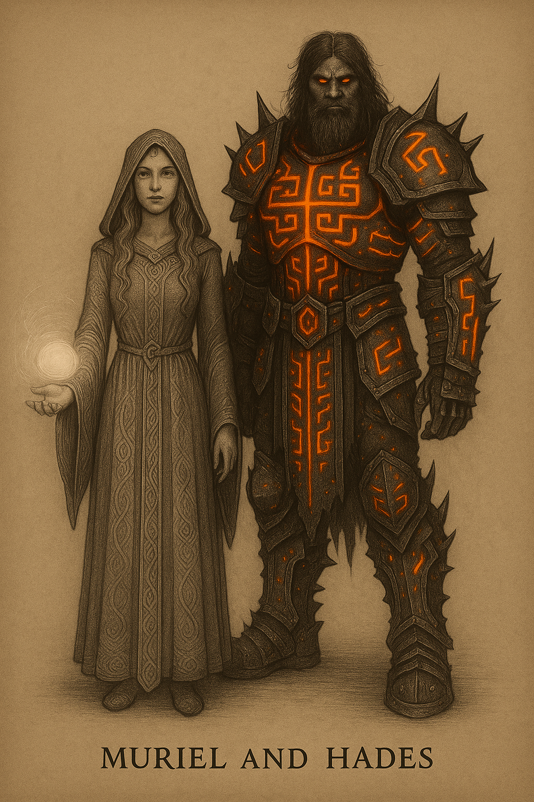

  

---

## Muriel & Hades

### 🇨🇦 Canadian English

**Essence**:  
Bound by a fate written in ancient fire and whispered through sacred ether, Muriel and Hades are the embodiment of duality: creation and destruction, light and abyss, love and vengeance.

**Muriel** is a guardian of life’s mysteries, a high priestess who channels the cosmic forces with wisdom and serenity. Her light heals, protects, and awakens.  
**Hades**, once a god of the underworld, returned through the Revenant Cycle as a warrior clad in fire-infused armour. His body is destruction, his soul is a battlefield — and Muriel is the only voice that soothes his torment.

Together, they represent the final hope for balance in the multiverse — a harmony not born of peace, but of equilibrium earned through sacrifice. Their presence within the Patch *The Revenant* defines the boundary between extinction and redemption.

---

### 🇫🇷 Français Canadien

**Essence** :  
Liés par un destin gravé dans le feu ancien et murmuré à travers l’éther sacré, Muriel et Hadès incarnent la dualité : la création et la destruction, la lumière et l’abîme, l’amour et la vengeance.

**Muriel** est une gardienne des mystères de la vie, une grande prêtresse qui canalise les forces cosmiques avec sagesse et douceur. Sa lumière guérit, protège et réveille.  
**Hadès**, autrefois dieu des enfers, revient à travers le Cycle du Revenant en tant que guerrier vêtu d’une armure infusée de feu. Son corps est la destruction, son âme est un champ de bataille — et Muriel est la seule voix capable d’apaiser son tourment.

Ensemble, ils représentent le dernier espoir d’un équilibre dans le multivers — une harmonie non née de la paix, mais du sacrifice. Leur présence dans le Patch *Le Revenant* marque la frontière entre l’extinction et la rédemption.
